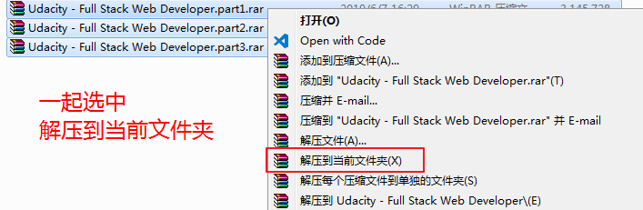
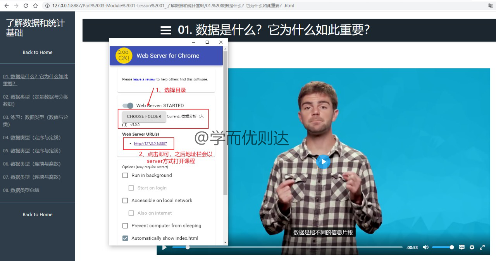

## 1、解压说明

若有多个压缩包，请下载完全后，再一起解压到当前文件夹即可。

PS：Mac系统建议用The Unarchiver解压，AppStore里就有。（若用其它解压软件，可能出现解压后文件为空的情况，即解压后的文件夹比压缩包还小。）

## 2、课程使用

- 打开文件夹下的【index.html】文件即可。为正常加载视频字幕，需使用 Chrome 浏览器，并安装插件 [Web Server for Chrome](https://chrome.google.com/webstore/detail/web-server-for-chrome/ofhbbkphhbklhfoeikjpcbhemlocgigb/related)。安装完之后在地址栏 chrome://apps/ 可以找到。

- 不会科学上网的同学，可百度【谷歌上网助手】，或直接下载 [火狐浏览器v67版](https://pan.baidu.com/s/1kCJsq80A4sHpb2Wyt8BLww) 使用，其它浏览器目前都不支持。

- 观看视频时点击网页右下角的【cc】按钮可加载字幕，点击【齿轮】按钮可选择字幕语种和播放速度。

- 课程中的 workspace 部分，使用网盘中的代码即可。

## 3、本地环境配置

根据代码语言在本地安装对应的运行环境即可，以 Python 为例，百度安装 Anaconda 即可。
如果您不熟悉，可百度或下载资料 [Python环境配置](https://pan.baidu.com/s/1CRVrY2TkPkvy6NkqRhxS4w) 学习，提取码：9ygv。

## *、其它问题

如果某些Lesson无法打开，原因及解决方案如下：
- 文件夹的路径太长。将文件夹整体往外层放即可。
- 文件名里有 & 等特殊符号。进入子文件夹打开 index.html 即可。